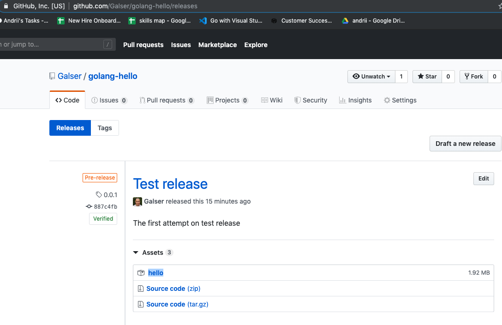

# Description

This repository contains GoLang program that prints hello. To run this program we are going to use *virtual machine* managed by [Vagrant](https://www.vagrantup.com/) -  tool for building and managing virtual machine environments in a single workflow. Short introduction for Vagrant can be found [here](https://www.vagrantup.com/intro/index.html). This repository provides appropriate instructions and files to provision your own VM and run inside it the sample **"hello"** program. 

*Code had been tested under MacOs Mojave 10.14.6 and Ubuntu 18.04.3 LTS (Bionic Beaver)*


# Usage

## Requirements (first-time run)
As a prerequisite you will need git command-line tools or another way to clone this git repo, if you don't have it, please [find here installation instructions](https://git-scm.com/book/en/v2/Getting-Started-Installing-Git) for various operation systems. In addition you will need some way of creating virtual machines, the providers for this step may vary a lot from architecture to architecture, but one that can be suggested as first time approach is VirtualBox, download the binaries for your [platform here](https://www.virtualbox.org/wiki/Downloads) and then follow [instructions for installation](https://www.virtualbox.org/manual/ch02.html)

## Instructions

In order to run the code, you need to start the VM and provisioned it. The [Vagrantfile](Vagrantfile), supplied with this repo contains all necessary step automated, just follow the short instruction below :

1. Install **Vagrant** , please follow instructions here : [official Vargant installation manual](https://www.vagrantup.com/docs/installation/)
2. You need the copy of the code, so - run in terminal ``git clone https://github.com/Galser/golang-hello.git`` ; in case you are using other Git Client - please follow appropriate instruction and download(clone)) this repo. 
3. Locate folder that now contains the copy of repository and open it. To do this in Terminal type ``cd location_to_the_folder_with_repo_copy`` 
4. To create and provision virtual machine with Vagrant - execute from command line ``vagrant up``
5. Now wait, Vagrant will download the operation system image, do all the steps, and when the machine is started and provision successfully finished, you should see as the last two lines: 
```
    default: Compile and build were successful, executing our program : 
    default: hello
```
6. At this point, you can try to run the program yourself, you have VM up and running , so you can use SSH client ot connect to it. To do so - execute from command-line : ```vagrant ssh```
7. Now you are in the VM's shell, to run teh program just execute  ```hello```, you should see response **hello**
8. While still inside virtual machine, you may be curious about the code.  It is available inside the vm in this location  ```/vagrant/hello.go```
9. When you've done with the and don't need VM anymore - you should exit the SSH session - by executing in command line ``exit``
10. To complete destroy the VM and free up all your system resource (CPU, memoery) you will need to give to vagrant instruction to do so, execute from command line ``vagrant destroy``. Next you should see the question on a new line :
``` default: Are you sure you want to destroy the 'default' VM? [y/N]  ```
Answer 'y' from keyboard, and you are good to go


# NOTES

*The code in releases currently is Linux 64Bit ELF executable.*
For example this binary :  [0.0.1](https://github.com/Galser/golang-hello/releases/download/0.0.1/hello) 


# TODO

- [ ] - Clarify README even more

# DONE

- [x] Create VM with Vagrant
- [x] Install go programming lang
- [x] Create instructions/usage section - how to create the box and install Go
- [x] Configure go environment
- [x] update instructions for the step
- [x] Create a sample main.go file
- [x] Compile the code
- [x] Run the code
- [x] Tune provision to include the automated run of hello.go for testing purpose
- [X] Update instructions for creating VM - provision it - compile and run the code
- [x] travis test that check for hello (travis run green build)
  - [x] create test
  - [x] make travis provision config for test
- [x] travis setup release
- [x] run release and do visual check for uploaded release, screnshot below :
    


Thank You! 
